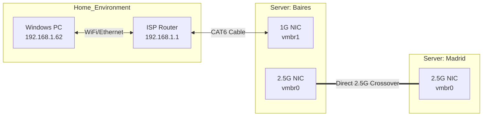
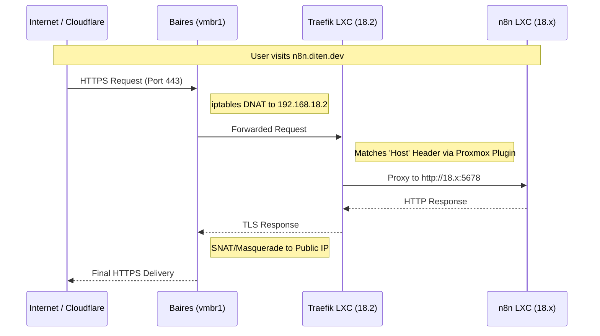
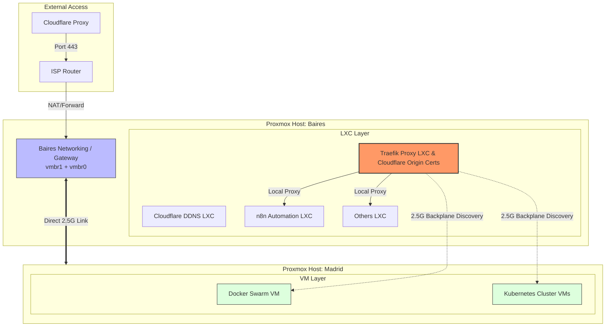

# HomeLab: Highish-Performance Proxmox Cluster Gateway Architecuture

**1\. Physical & Logical Topology**

The cluster is built on a **Back-to-Back 2.5G link** between two nodes: **Baires** (Master/Gateway) and **Madrid** (Worker). By connecting them directly, we eliminated switch latency for Corosync and data replication.

- **Baires (192.168.1.20 / 192.168.18.20):** Acts as the L3 Router and Firewall.
- **Madrid (192.168.18.21):** Pure cluster node using Baires as its internet exit.
- **The Decision:** Use **Baires** as a "Multi-Homed" host to isolate the cluster traffic from the home network.







**2\. Layer 3 Routing & NAT**

To allow the cluster to reach the internet and be reachable from the outside, we transformed Baires into a Linux Router using `iptables` and kernel forwarding.

- **Key Config (**`/etc/sysctl.conf`**):**
    
    ```
    net.ipv4.ip_forward=1
    net.bridge.bridge-nf-call-iptables=1
    ```
    
- **The "Return Path" (SNAT):** We used `SNAT` instead of `MASQUERADE` for better stability with the ISP router.
    
    ```
    iptables -t nat -A POSTROUTING -s 192.168.18.0/24 -o vmbr1 -j SNAT --to-source 192.168.1.20
    ```
    

---

**3\. The "Front Door": Traefik & Cloudflare**

We opted for a **Traefik LXC** as a centralized Reverse Proxy. Instead of Let's Encrypt challenges (which can fail behind NAT), we used **Cloudflare Origin Certificates** for "Full (Strict)" end-to-end encryption.

- **Architectural Decision:** Point the ISP Router's port forward to **Baires (1.20)**, then use Baires to internal-forward to **Traefik (18.2)**.
- **Baires Prerouting:**
    
    ```
    iptables -t nat -A PREROUTING -i vmbr1 -p tcp --dport 443 -j DNAT --to-destination 192.168.18.2:443
    ```
    

---

**4\. Automated Service Discovery**

To avoid manual configuration of every new service, we implemented two automation layers:

1.  **Network Level:** `dnsmasq` on Baires provides DHCP and static leases to the `.18.x` network.
2.  **Application Level:** The **Traefik Proxmox Plugin** monitors LXC metadata (Notes field).

    ```
    traefik.enable=true
    traefik.http.routers.docmost.rule=Host(docmost.domain.net)
    traefik.http.routers.docmost.entrypoints=websecure
    traefik.http.services.docmost.loadbalancer.server.port=3000
    traefik.http.routers.docmost.tls=true
    ```

- **Traefik Proxmox Plugin Config:**
    
    ```
    providers:
      plugin:
        proxmox:
          url: "https://192.168.18.20"
          tokenName: "traefik@pam!token"
    ```
    
- **LXC Discovery:** Simply adding `traefik.enable=true` to an LXC's **Notes** in the Proxmox GUI automatically publishes the service to the web.

---

**5\. Lessons Learned**

- **LXC Firewalls:** Proxmox's per-interface MAC/IP filters can silently drop ARP/Ping traffic even if the main firewall is "Off."
- **dnsmasq**: Install and disable the service in the cluster (Baires)
- **MTU/MSS Clamping:** Routing between 2.5G and 1G interfaces often requires MSS clamping to prevent packet fragmentation.
- **Hairpin NAT:** Internal testing requires a local `hosts` entry or a split-brain DNS since most ISP routers don't support NAT Loopback.
- **Cloudflare-DDNS**: Remember to activate and check this component after initial deployment.
